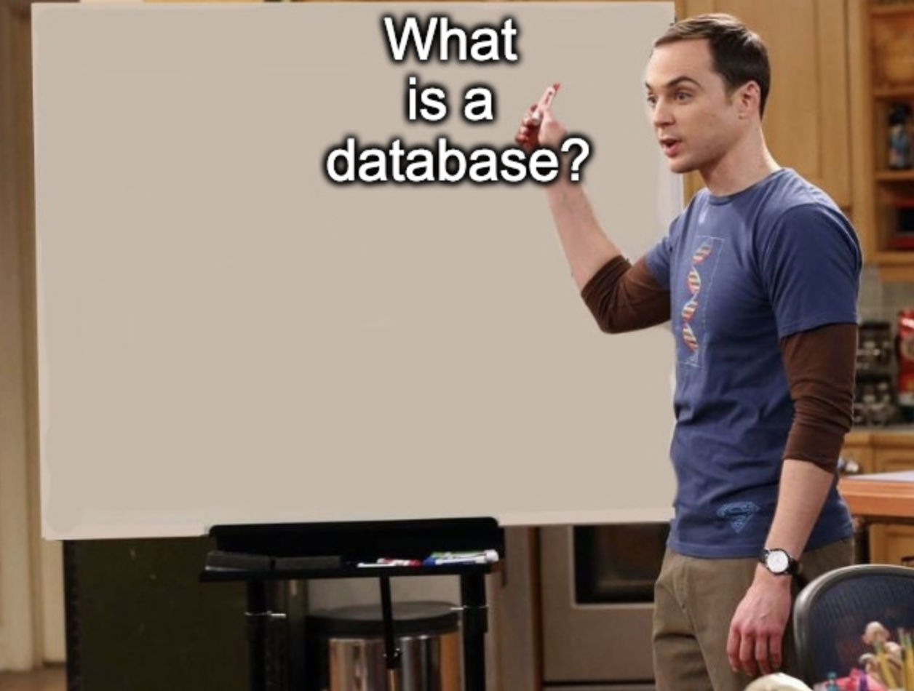
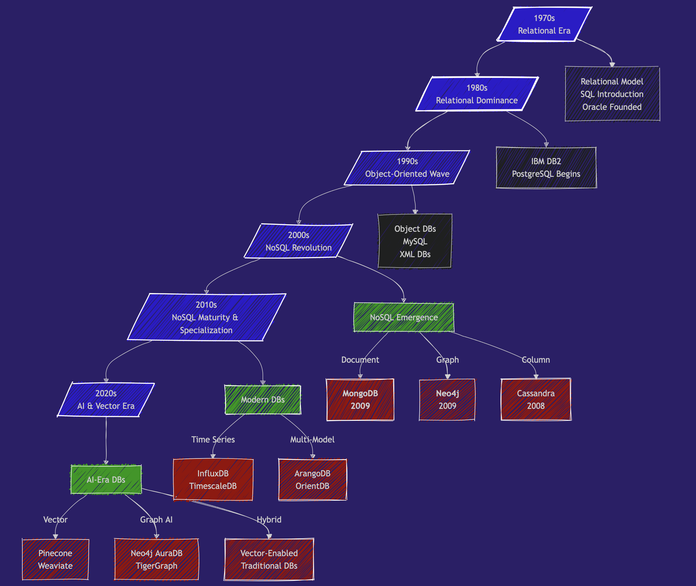
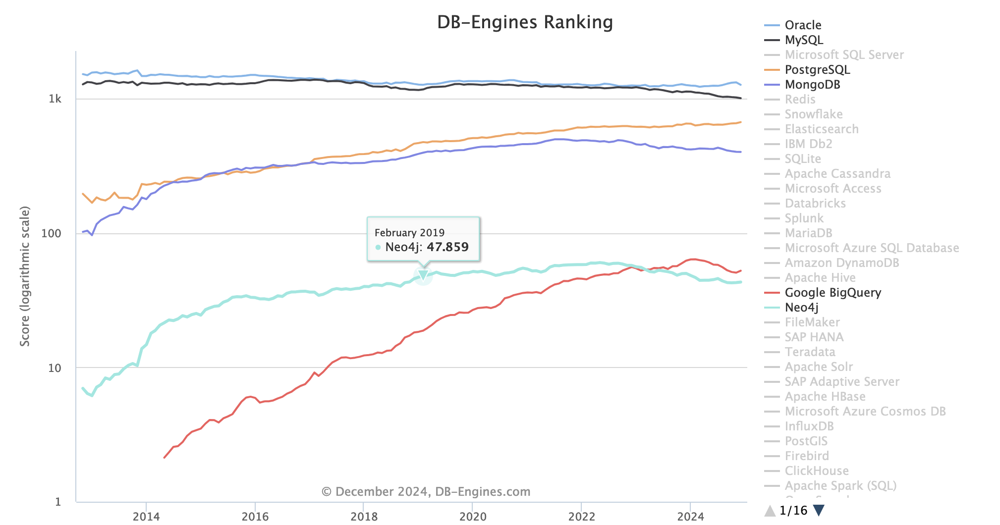
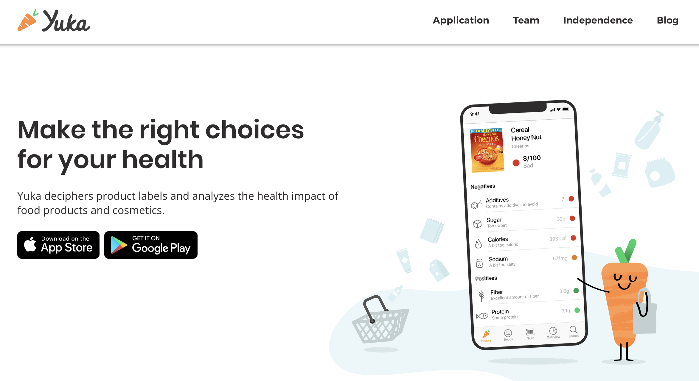
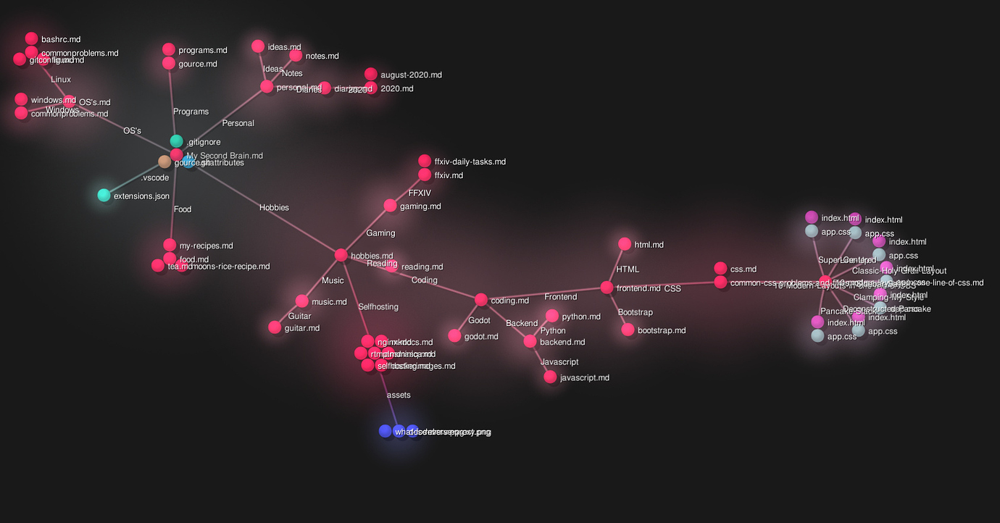

- [NoSQL and graph databases](#nosql-and-graph-databases)
  - [What is a database ?](#what-is-a-database-)
  - [What we expect from a DBMS](#what-we-expect-from-a-dbms)
  - [A brief history of databases 1970-2024](#a-brief-history-of-databases-1970-2024)
    - [1970s - The Relational Era Begins](#1970s---the-relational-era-begins)
    - [1980s - Relational Dominance](#1980s---relational-dominance)
    - [1990s - Object-Oriented Wave](#1990s---object-oriented-wave)
    - [2000s - The NoSQL Revolution Begins](#2000s---the-nosql-revolution-begins)
      - [Why the timing ?](#why-the-timing-)
    - [2010s - NoSQL Matures \& Specialization - Big Data and Specialized Databases](#2010s---nosql-matures--specialization---big-data-and-specialized-databases)
    - [**2020s: AI, Vector Databases, and Real-Time Needs**](#2020s-ai-vector-databases-and-real-time-needs)
    - [Current Trends (2024)](#current-trends-2024)
    - [In Short](#in-short)
  - [Key Database Categories Today](#key-database-categories-today)
    - [Ecosystem](#ecosystem)
  - [SQL](#sql)
    - [Hierarchy of SQL Database:](#hierarchy-of-sql-database)
  - [NoSQL](#nosql)
    - [Hierarchy of MongoDB - NoSQL database - MongoDB](#hierarchy-of-mongodb---nosql-database---mongodb)
    - [Terminology](#terminology)
  - [Schema-less or dynamic schema](#schema-less-or-dynamic-schema)
    - [Yuka and Food products](#yuka-and-food-products)
      - [Nutriscore](#nutriscore)
  - [Introducing Schema Flexibility](#introducing-schema-flexibility)
    - [Data presence and type](#data-presence-and-type)
    - [Nested / Complex Data](#nested--complex-data)
    - [Consequences of schema flexibility](#consequences-of-schema-flexibility)
  - [When to choose NoSQL (document database) over SQL ?](#when-to-choose-nosql-document-database-over-sql-)
    - [Performance](#performance)
    - [In short](#in-short-1)
  - [What about Graph databases ?](#what-about-graph-databases-)
    - [Relationships](#relationships)
  - [conclusion](#conclusion)


# NoSQL and graph databases

This course covers two types of non SQL databases:

- MongoDB - NoSQL
- Neo4j - a graph database

Before we dive into the specifics of these platforms, Let's start with the question

## What is a database ?




**Is a spreadsheet a database ?**

I've heard people talk about a CSV or excel file as a database. And it makes me cringe.

How can something so simple as a CSV file can be put on the same level as engineering wonders such as PostgresSQL, Weaviate, MongoDB, Neo4j, Redis, Mysql etc ...

So I asked my dear friend GPT-4o, to give me a definition of a database and this is what it told me

> In layman's terms:
  "A database is like a smart notebook or filing system that helps you keep track of lots of information and find exactly what you need in no time."

which definitely includes csv files, excel files, json files, XML files and so many other simple formats based on one file.

If we look for the definition of a database in a more classic and venerable source of knowledge, such as the [Britanica Encyclopedia](https://www.britannica.com/technology/database) we get:

> database, any collection of data, or information, that is specially organized for rapid search and retrieval by a computer. Databases are structured to facilitate the storage, retrieval, modification, and deletion of data in conjunction with various data-processing operations.

See also the database article on [Wikipedia](https://en.wikipedia.org/wiki/Database).

Very interesting. We're no longer talking about finding information quickly (the **retrieval** part) but also

- storage
- modification
- deletion

and Administration.

That's where a simple spreadsheet no longer fits the purpose.

## What we expect from a DBMS

DBMS: database management system

| Feature                | Description                                                                     | Excel | DBMS |
|------------------------|---------------------------------------------------------------------------------|----|---|
| **Data Storage and Retrieval** | Stores data in an organized manner and retrieves it when needed.          | ✅ | ✅ |
| **Data Manipulation**         | Allows you to add, modify, or delete data.                                | ✅ | ✅ |
| **Data Querying**             | Lets you ask complex questions (queries) about the data.                  | ✔️ | ✅ |
| **Data Organization**         | Structures data in formats like tables, documents, or graphs to make it easy to manage. | ✅ | ✅ |
| **Data Sharing**              | Allows multiple users or applications to use the database simultaneously. | ✅ | ✅ |
| **Data Security**             | Protects data from unauthorized access or corruption.                    | ✔️ | ✅ |
| **Concurrency Control**       | Manages multiple users modifying the data at the same time without conflicts. | |  ✅ |
| **Backup and Recovery**       | Ensures that data is not lost and can be restored in case of failures.    | ✔️ |  ✅ |
| **Data Integrity**            | Ensures the data remains accurate, consistent, and reliable.              | |  ✅ |
| **Performance Optimization**  | Provides tools to optimize speed and efficiency for data retrieval and updates. | |  ✅ |
| **Support for Transactions**  | Ensures a group of operations (transactions) is completed entirely or not at all. <br> ACID compliance | |  ✅ |

## A brief history of databases 1970-2024

> tldr; Our course starts 15 years ago, in 2009, which is 20 years after **PostgreSQL** was born.




### 1970s - The Relational Era Begins

- **1970**: **[Edgar Codd](https://en.wikipedia.org/wiki/Edgar_F._Codd)** publishes "[A Relational Model of Data for Large Shared Data Banks](https://github.com/SkatAI/epita-graph-nosql/blob/master/pdfs/codd.pdf)"
- **1974**: **IBM** develops System R, the first SQL DBMS prototype
- **1979**: **Oracle** releases the first commercial SQL implementation

### 1980s - Relational Dominance

- **1989**: Postgres (now [PostgreSQL](https://www.postgresql.org/)) development begins at UC Berkeley
  - 🎖️🎖️🎖️ best in class multi purpose database.
  - can handle no-sql & vector,
  - many extensions (http, postgis, ...).
  - amazing performance.
  - and OPEN SOURCE (free, efficient and secure).

### 1990s - Object-Oriented Wave

- **1991**: Object-Oriented Databases gain attention. <br> Most OODBs from the 90's are no longer used. But they influenced the evolution of SQL and NoSQL databases.
- **1995**: MySQL released as open source

### 2000s - The NoSQL Revolution Begins

- 2 important papers that lays the ground for NoSQL systems: [BigTable paper](https://research.google.com/archive/bigtable-osdi06.pdf) (Google, 2004) and [Dynamo paper](https://www.amazon.science/publications/dynamo-amazons-highly-available-key-value-store) (Amazon, 2007)

And in **2009**, 2 new databases are released:

- 🥭🥭🥭 MongoDB
- 🎉🎉🎉 Neo4j

Tadaaah!

#### Why the timing ?

The rise of the world wide web (myspace 😍, youtube - 2005) and the massive scale up of applications by orders of magnitude.

All of a sudden, we have millions of people at the same time trying to access and modify Terabytes of data in milliseconds.

Relational databases can't keep up with the scale of applications, the chaotic nature of unstructured data and the speed requirement.

The promise of NoSQL is **volume and speed**.

### 2010s - NoSQL Matures & Specialization - Big Data and Specialized Databases

- **Big Data Databases**: Systems like **Apache Hadoop** (2006) and **Apache Spark** (2009) supported massive-scale data processing.
- **Graph Databases** gain popularity with use cases such as fraud detection, knowledge graphs, and supply chain management. Neo4j and Amazon Neptune become key players.
- **Time-Series Databases (e.g., InfluxDB, TimescaleDB):** designed for monitoring systems: IoT, logs, ...
- **Cloud Databases:** managed services like Amazon **RDS**, Google **BigQuery**, or **Snowflake**

and in the meantime, in 2013, **Docker** containers revolutionize database deployment

### **2020s: AI, Vector Databases, and Real-Time Needs**

- **Vector Databases** 🌶️🌶️🌶️ (e.g., Pinecone, Weaviate, Qdrant, Milvus, Faiss, ...):
  - Handles high-dimensional vector embeddings used in AI/ML applications

- and also :
  - 🌶️🌶️🌶️ **Graph + AI**: 🌶️🌶️🌶️ knowledge graphs and LLMs .
  - Multi-Model Databases that support multiple data models (document, graph, key-value) in one system.
  - Real-Time Analytics: optimized for real-time streaming data and analytics.
  - Serverless Databases

### Current Trends (2024)

Vector search is all the rage. Vector search capabilities are integrated in most existing DBMS. PostgreSQL, MongDB and Neo4j included.


### In Short

- 1989: Launch of PostgreSQL
- 2009: Launch of MongoDB and Neo4j
- 2024: vector databases are hot while older databases integrate vector search

## Key Database Categories Today

We have many databases to choose from. It all depends on the scale, the nature of the application, budget, etc

| Database Type          | Purpose                                | Examples                | Application                          |
|-------------------------|----------------------------------------|-------------------------|--------------------------------------|
| **Relational - SQL**    | Fixed schema  | PostgreSQL, MySQL, Oracle   | Transactions, normalization |
| **Document Stores**     | Flexible schema, JSON-like documents  | MongoDB, CouchDB        | Web applications, content management |
| **Graph Databases**     | Relationship-focused data             | Neo4j, ArangoDB         | Social networks, recommendation engines |
| **Key-Value Stores**    | Simple, fast lookups                  | Redis, DynamoDB         | Caching, session management          |
| **Vector Databases**    | Similarity search, AI embeddings      | Pinecone, Weaviate      | AI applications, semantic search     |
| **Column-Family Stores**| Wide-column data, high scalability    | Cassandra, HBase        | Time-series, big data applications   |
| **Time-Series Databases**| Time-ordered data                    | InfluxDB, TimescaleDB   | IoT, monitoring systems              |

### Ecosystem

Check out the ranking for all databases on <https://db-engines.com/en/ranking>

The trends : <https://db-engines.com/en/ranking_trend>



Many many actors :


from <https://www.generativevalue.com/p/a-primer-on-databases>

Let's take a step back and compare relational a SQL and a  NoSQL database.

## SQL

A relational database:

- uses a predefined **schema**:  the structure of the data (columns, data types, etc.) is fixed.
- is great for complex queries, transactions, and ensuring data consistency (ACID compliance).

A **relational database** can be compared to a collection of well-organized spreadsheets (tables) where every column is defined, and sheets are inter-connected.

Tables have columns and rows of data. Each table has a unique key called the **primary key**.

Schema design is about (de)normalization. Deciding where a piece of information should reside uniquely or not.

> Important concept of **Normalization** : a piece of information exists only in one place and one place only.

### Hierarchy of SQL Database:

- A **foreign key**  links a  table to another table
- A **row** holds the value for an _entity_
- A **column** is an **attribute** or property of the _entity_
- A **table** holds all the entities that are grouped together in a fixed structure of columns

SQL databases = tight. under control. data is consistent. stable. but can be complex.

## NoSQL

A **non-relational database** is a flexible folder system where you can store items in different shapes and forms without strict rules.

- **flexible schema** with unstructured or semi-structured data
- ideal for high scalability and handling massive, **distributed** workloads.

Think of (JSON) documents instead of tables.

- A **collection** is a set of **documents**.
- A document is a combination of keys : values.
- Each collection has a unique key  (the _id field)
- Within a document, you may have nested subdocuments. A person can have multiple phones, email addresses, jobs, ...

All the documents in a collection are **similar in structure** but they don't have to be exactly the same.

There is no concept of normalization

### Hierarchy of MongoDB - NoSQL database - MongoDB

- A **database** holds **Collections**
- A **collection** holds all the **documents**
- A **document** is the entity or data value
- A subdocument (nested) is a document **within** a parent document.
- A **field** is an attribute or property of the document

NoSQL databases = fluid, adaptive, letting go.

### Terminology

MongoDB - SQL:

- A `document` is a record, a row
- A `Collection` is a table
- A `Field` is a Column

| MongoDB | SQL Database |
|----------|--------------|
| Database | Database |
| Collection | Table |
| Document | Record/Row |
| Field | Column |
| Embedded Document | Foreign Key |
| `_id` | Primary Key |
| `$lookup` | JOIN |

An `index` remains an `index`

## Schema-less or dynamic schema

In what situation is the data so dynamic that we need a special type of databases ?

The most common example of NoSQL application is that of a social network.

- user profiles
- posts have all kinds of content
- timeline, followers, etc

### Yuka and Food products

Let's take the example of a start up like [Yuka](https://yuka.io/en/)



In their own words: _Yuka deciphers product labels and analyzes the health impact of food products and cosmetics._


Its underlying database is the [open food facts database](https://world.openfoodfacts.org/), a food products database made by everyone, for everyone. with over 3.5 Million food products.

Check for instance the information for [Nutella](https://uk.openfoodfacts.org/product/3017620422003/nutella) and the one for ... [Baguette](https://world.openfoodfacts.org/product/3250393046940/baguette-constance-cereales-250g-la-campaniere)

See also this article that explores the dataset with python pandas: https://medium.com/@achrafelkhanjari99/a-deep-dive-into-the-open-food-facts-dataset-56259b162ac5 (available as pdf on the Github repo)

With that many products, the information available and the related information (Packaging, Carbon Impact) as well as the diversity of regulations (EU, US, UK, ... etc ) varies all the time.

Data is constantly updated while keeping history of changes and novelties.

- new data becomes available as actors implement data collection. think traceability, safety, etc
- new regulations impose more data
- news, social trends and focus changes rapidly (gluten free, tuna and mercury, ...)

So you start your database with a simple schema that includes

- name, definition, image, description
- nutritional values
- ingredients

But the schema gets more and more complex as the data and the company's products and services evolve.

#### Nutriscore

Take for instance the Nutriscore label:


[Nutriscore](https://nutriscore.blog/2022/08/04/report-of-the-european-scientific-committee-in-charge-of-updating-the-nutri-score-changes-to-the-algorithm-for-solid-foods/) has recently evolved with a new more stringent version. You need new Nutriscore labels while keeping the old one because not all products implement the new Nutriscore. Some companies have even dropped the labelling altogether.

You started with a Nutriscore table in a SQL database:

```sql
product_id: key
nutriscore_label : array[A,B, .., E]
```

so your Nutriscore table needs a new column

```sql
product_id: key
nutriscore_label: array[A,B, .., E]
nutriscore_new_label: array[A,B, .., E]
```

However, most products don't have a new nutriscore label yet.

And you end up with plenty of null values in that `nutriscore_new_label` column and null values are evil 👹👹👹.


You can also normalize the table and introduce a Nutriscore version column to help with the Null values.

```sql
product_id: key
nutriscore_label: array[A,B, .., E]
nutriscore_version: Int
```

In both cases, you have to change all your SQL queries in your code base.

Big pain, big hassle, headache, hidden bugs, and extra costs ＄＄＄.

## Introducing Schema Flexibility

**Schema Flexibility** in MongoDB and some other NoSQL databases refers to the ability to store data without requiring a predefined schema. This means that documents in the same collection can have different fields, structures, and data types.

Schema Flexibility helps handle  **unknown unknowns** in a fast ever-changing world.

### Data presence and type

In MongoDB: You can just add a new Nutriscore item to food products:

No Nutriscore

```json
{
  "product_id": 198273,
  "name": "Corn Flakes Cereals",
}
```

Nutriscore is added, just add a field to the product document


```json
{
  "product_id": 198273,
  "name": "Corn Flakes Cereals",
  "Nutriscore": "C"
}
```

New Nutriscore version comes up, just add the Nutriscore label as an dictionary with versions as keys:

```json
{
  "product_id": 198273,
  "name": "Corn Flakes Cereals",
  "Nutriscore": {
    "v1": C,
    "v2": D,
  }
}
```

Multiple representations can **co-exist** in the same database.

- No nutriscore
- A single nutriscore as string
- Nutriscore dictionary as a nested / embedded document

### Nested / Complex Data

- SQL requires normalization into multiple tables for complex structures
- MongoDB can **nest** related data naturally

Another example is that of a person's address

```json
// A person with no recorded addresses
{
    "_id": "1",
    "name": "Anita Sharma",
    "age": 29,
    "email": "anita.sharma@example.com"
}

// A person with a single address as a dictionary
{
    "_id": "2",
    "name": "Rahul Verma",
    "age": 42,
    "email": "rahul.verma@example.com",
    "addresses": {
        "type": "home",
        "street": "12 MG Road",
        "locality": "Indiranagar",
        "city": "Bengaluru",
        "state": "Karnataka",
        "pincode": "560038",
        "country": "India"
    }
}

// A person with multiple addresses as a list of dictionaries
{
    "_id": "3",
    "name": "Priya Singh",
    "age": 35,
    "email": "priya.singh@example.com",
    "addresses": [
        {
            "type": "home",
            "street": "45/2 Lajpat Nagar",
            "locality": "Central Market",
            "city": "New Delhi",
            "state": "Delhi",
            "pincode": "110024",
            "country": "India"
        },
        {
            "type": "work",
            "street": "4th Floor, Tower B",
            "locality": "DLF Cyber City",
            "city": "Gurugram",
            "state": "Haryana",
            "pincode": "122002",
            "country": "India"
        }
    ]
}
```

### Consequences of schema flexibility

Schema Flexibility impacts every step of a database life cycle

- **Design**: without clear rules, everything becomes possible. The design choices are driven by the application. How the data is _consumed_, dictates the structure of the data in the database.
- **Development**: with flexible schema, changes can be implemented faster.
- **Maintenance**: the downside is the need to handle older data organization and types

Extra caution is required to avoid chaos and **data inconsistencies**. Query performance might be affected if changes in the data structure  lead to inefficient or inconsistent indexing.

With NoSQl databases, the cost of implementing changes in the nature of the data is moved from the database to the application level.

However, inconsistencies in the database can still occur if multiple applications interact with the same database differently.

> In short, schema flexibility is to be used with caution and only when useful and justified.

## When to choose NoSQL (document database) over SQL ?

So when is a NoSQL Document database a better choice than SQL ?


- Your data naturally fits a **document** structure rather than strict tables
  - You want to store related data together rather than spread across tables to speed up information retrieval. simpler queries, less joins, less code complexity.

- Rapid Iteration: Your schema needs to evolve quickly and you prioritize development speed over strict data consistency
  - Fast changing application and data requirements
  - Early stage startups where the data model isn't fully understood yet

- also: A/B testing different features that might require different data structures

- Scalability and Performance
  - Designed for **horizontal scaling** with built-in support for **sharding** (distributing data across multiple servers).
  - Suited for handling large-scale, high-throughput, and geographically distributed applications.

MongoDB scales out, while PostgreSQL scales up.

- Uses a flexible JSON-like document model (BSON), making it ideal for hierarchical or semi-structured data.
  - Reduces the need for complex joins, as related data can be embedded in a single document.

MongoDB Excels:

- Applications with unstructured or semi-structured data.
- High-velocity workloads requiring rapid schema changes.
- Use cases requiring horizontal scaling across distributed environments.

### Performance

In terms of performance, the comparison most of the time favors PostgreSQL over MongoDB.
see [MongoDB Vs PostgreSQL: A comparative study on performance aspects](https://link.springer.com/article/10.1007/s10707-020-00407-w)

And this other article, [MongoDB vs PostgreSQL: Choosing the Best Database for Your Needs](https://www.halfnine.com/blog/post/mongodb-vs-postgresql), sums it well:

> _MongoDB shines in scenarios requiring the development of software applications that deal with diverse data types in a scalable manner. It is particularly suited for projects that need to support rapid iterative development and facilitate the collaboration of numerous teams.

In [Postgres vs. MongoDB: a Complete Comparison in 2024](https://www.bytebase.com/blog/postgres-vs-mongodb/)

### In short

- Choose MongoDB if your application has a simple data model and handles web scale data.
- Choose PostgreSQL if your application has complex business logic and requires complex queries.

## What about Graph databases ?

SQL database are called relational databases.

In a SQL database the relation between tables is explicitly defined by foreign keys.

- Product ->  Vegetables -> Location, Origin
- Product ->  Vegetables -> Organic / not Bio
- Product -> nutrition (sugar, fat etc)
- Product -> Nutriscore labels
- Product -> ConsumeBy

And the ERD for such a database only indicates the cardinality of the relation:

- 1 to 1
- 1 to many


When you ask an LLM to generate a diagram for a product database, it naturally adds some meaningful information to the relations between tables.


[Mermaid](https://mermaid.live) diagram


### Relationships

Graph database are all about the _meaning_ of **relationships** between entities.

> In graph databases such as Neo4j, **relationships** are as important as the data itself and are stored explicitly.

These relationships have their own properties and are stored as connections.

While in SQL:

- Relationships are implicit through foreign keys
- Must be reconstructed through JOINs
- Get exponentially more complex and slower as you follow multiple levels of connections

That's why Neo4j excels at questions like:

- "Find all friends of friends who like running and live in Paris"
- "What's the shortest path between person A and person B?"
- "Who are the most influential people in this network?"

Here's an example of a knowledge graph with Obsidian




We will come back to Neo4j in 2 weeks.

## conclusion

So SQL aka relational databases are great for data structure that does not change often and where relations between objects are stable.

No-SQL database like MongoDB : great when data specifications are evolving rapidly or are not set in stone, flexible schema, large scale

Graph database : relation is key. it's not only that there is a relation but also what is that relation about.

- NoSQL - Document is about scaling and data evolution.
- Graph is about answering specific questions, finding different type of meaning and hindsights in the data.
