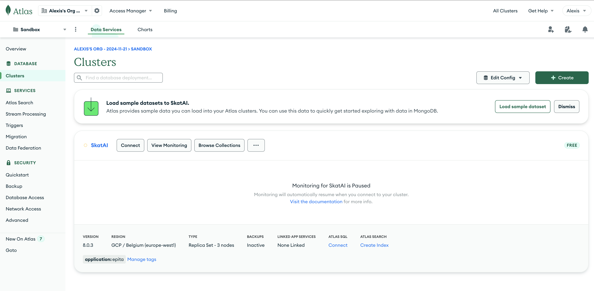
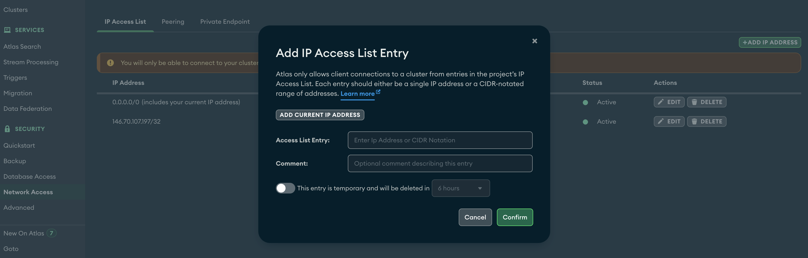
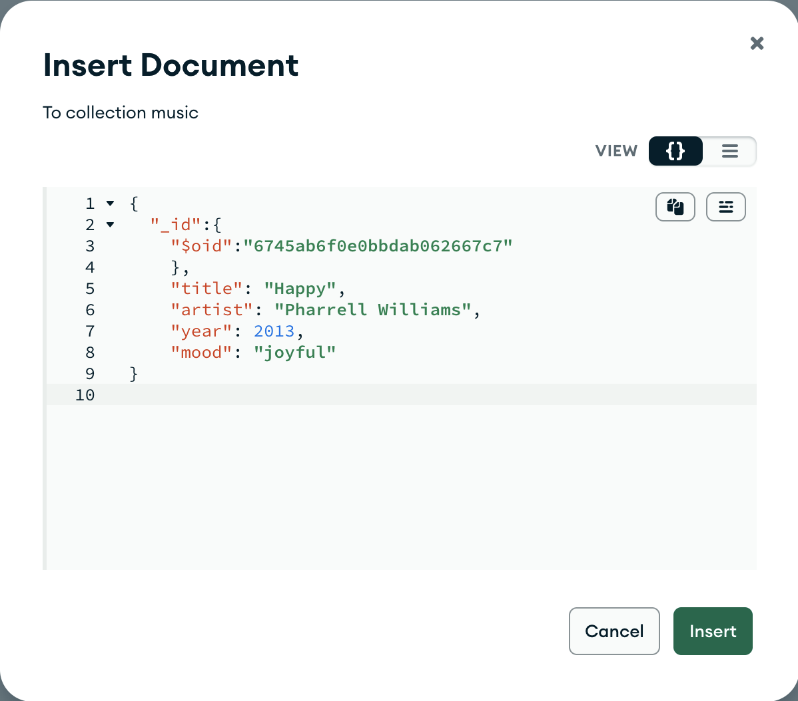
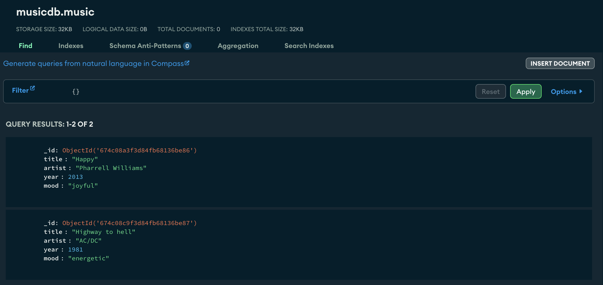
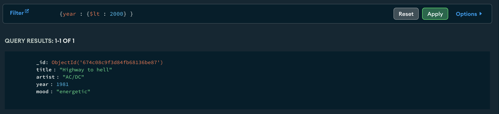
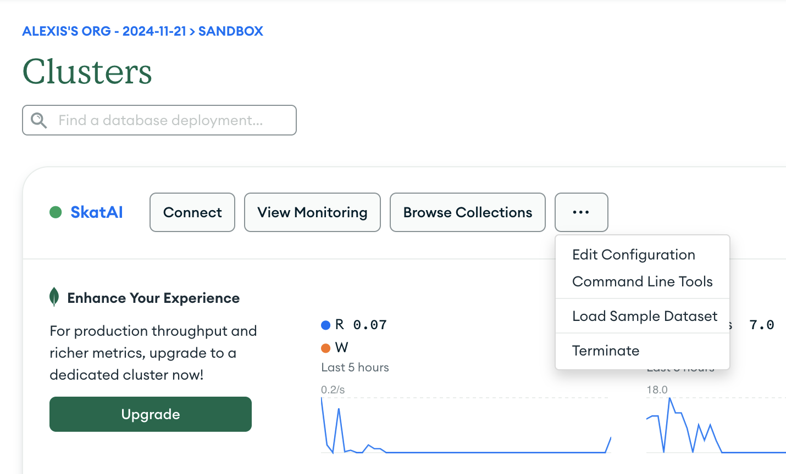
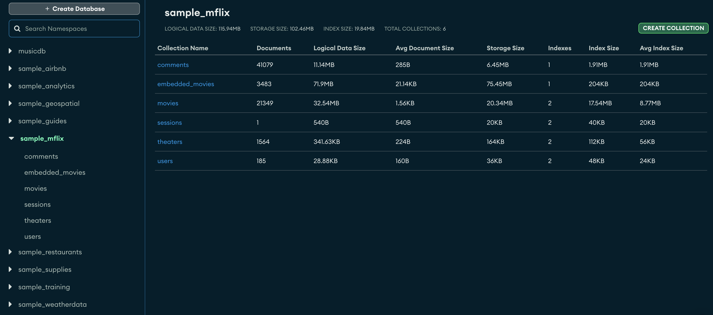
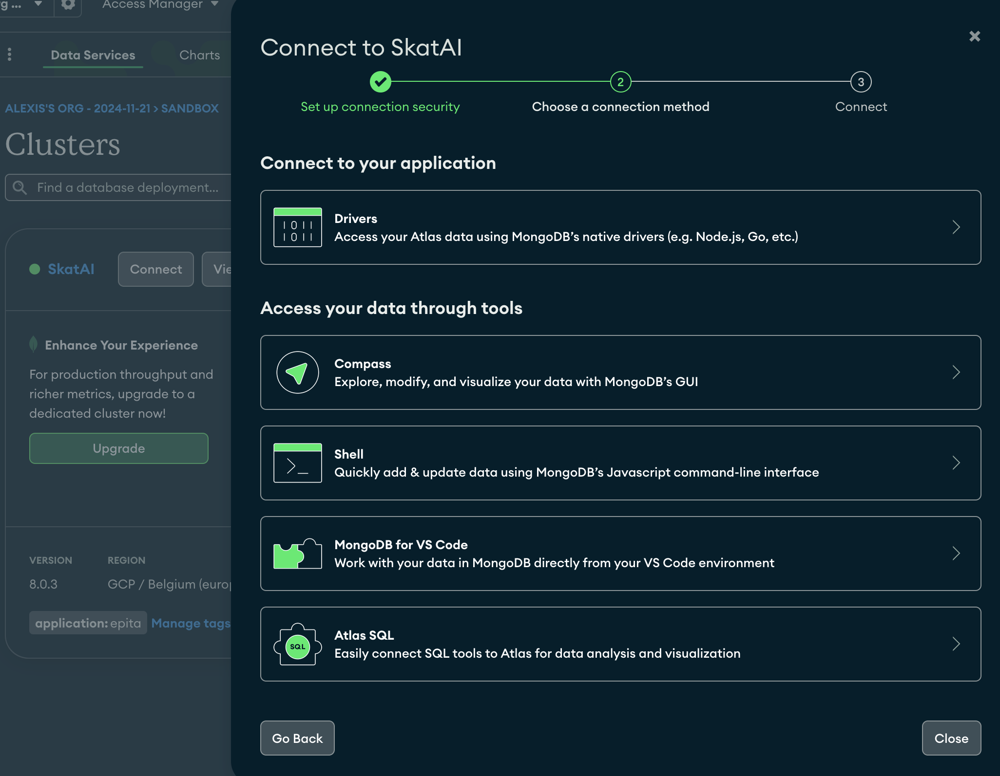
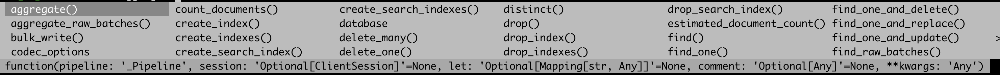

- [Guided practice on MongoDB Atlas](#guided-practice-on-mongodb-atlas)
  - [Many ways to work with MongoDB](#many-ways-to-work-with-mongodb)
  - [Atlas](#atlas)
    - [Important](#important)
    - [Then](#then)
  - [Querying in MongoDB](#querying-in-mongodb)
  - [Moaaar dataaaa!](#moaaar-dataaaa)
  - [Connect via your language](#connect-via-your-language)
    - [Connect In Python](#connect-in-python)
    - [Use the terminal with `mongosh`](#use-the-terminal-with-mongosh)
    - [Filtering](#filtering)
    - [Cursor](#cursor)
    - [Projection](#projection)
    - [Exercises](#exercises)
    - [Number of documents](#number-of-documents)
    - [Your turn](#your-turn)
  - [conclusion](#conclusion)
  - [going further](#going-further)

# Guided practice on MongoDB Atlas

In this document

- we work on MongoDB Atlas a hosted service of MongoDB
- create a database, load some docs and do a few queries
- then move on to working with python or the terminal and a more complex database

At the end of this session you should start to have a good grasp on MongoDB querying language.

Goals:

- You can connect to a MongoDB Atlas server
- You can create a database and insert documents
- You can build somewhat complex queries over a MongoDB database

## Many ways to work with MongoDB

On your local machine

- MongoDB Community Edition = Self-hosted, runs on your computer
- MongoDB Compass - the GUI tool for visualization
- `mongosh` the CLI in the terminal

You can also work with your favorite scripting language : python, node.js, go, ruby, PHP, Java, etc ...

Today we work on the hosted version Atlas.

[MongoDB Atlas](https://www.mongodb.com/lp/cloud/atlas/try4-reg) provides Cloud-hosted service with both free and paid tiers.

Atlas gives us a hosted cluster on which we can create a database, import some sample collections and understand how to do CRUD operations in MongoDB. You do not need to install anything.

> **CRUD** stands for Create, Read, Update, and Delete : the four basic operations for a DBMS

## Atlas

Let's start by creating an account on Atlas <https://www.mongodb.com/cloud/atlas/register>

Then:

- Create a cluster and a project (I called my project `Sandbox`)



### Important

- **Copy your database password**. It's best to set it as an environment variable or in a `.env` file (for python).

- Check that your **IP** is added to the list, visit `Network Access` (left navigation)
  - allow access from any IP using 0.0.0.0/0 (not recommended for production).



### Then

- Go to clusters
- Create a database: add name `songsdb` and collection name `songs`,
- Insert a Document

```json
{
  "_id":{
    "$oid":"6745ab6f0e0bbdab062667c7"
    },
    "title": "Happy",
    "artist": "Pharrell Williams",
    "year": 2013,
    "mood": "joyful"
}
```



And insert another one

```json
  "title": "Highway to hell",
  "artist": "AC/DC",
  "year": 1981,
  "mood": "energetic"
```

So we have 2 documents !

Let's explore !!! This is exciting 🤣🤣🤣 !

## Querying in MongoDB

In MongoDB querying comes down to writing JSON


| json                           | query                     |
| ------------------------------ | ------------------------- |
| `{}`                           | returns all the documents |
| `{ field : value  }`           | where field = value       |
| `{ field : { $lt : value }  }` | where field <= value      |

So if we want to find all the documents in our songs collection, simply write '{}' in the query field

This returns our 2 songs.



And the query `{ year: { $lt: 2000 } }` returns the song that was released before 2000.



## Moaaar dataaaa!

This is all nice but we need more data to play with.

Let's import the ATLAS sample datasets.

Goto `Clusters > dots > load sample dataset`



Then click on your project name (for me Sandbox ) and `Browse collections` to view the available databases

You get a new database `movies_mflix` with 5 collections.



Look at the `embedded_movies` collection that has 1525 documents and notice the structure of a document

A document is a JSON record.

It can have:

- **nested JSON** : check out the nested dictionaries `imdb` and the `tomatoes` fields.
- **arrays**: check out genres, cast, languages, writers, ...

The primary key of a collection is always "`_id`".

```json
{
    "_id": {
        "$oid": "573a1390f29313caabcd5293"
    },
    "plot": "Young Pauline is left a lot of money when her wealthy uncle dies. However, her uncle's secretary has been named as her guardian until she marries, at which time she will officially take ...",
    "genres": [
        "Action"
    ],
    "runtime": {
        "$numberInt": "199"
    },
    "cast": [
        "Pearl White",
        "Crane Wilbur",
        "Paul Panzer",
        "Edward Josè"
    ],
    "num_mflix_comments": {
        "$numberInt": "0"
    },
    "poster": "https://m.media-amazon.com/images/M/MV5BMzgxODk1Mzk2Ml5BMl5BanBnXkFtZTgwMDg0NzkwMjE@._V1_SY1000_SX677_AL_.jpg",
    "title": "The Perils of Pauline",
    "fullplot": "Young Pauline is left a lot of money when her wealthy uncle dies. However, her uncle's secretary has been named as her guardian until she marries, at which time she will officially take possession of her inheritance. Meanwhile, her \"guardian\" and his confederates constantly come up with schemes to get rid of Pauline so that he can get his hands on the money himself.",
    "languages": [
        "English"
    ],
    "released": {
        "$date": {
            "$numberLong": "-1760227200000"
        }
    },
    "directors": [
        "Louis J. Gasnier",
        "Donald MacKenzie"
    ],
    "writers": [
        "Charles W. Goddard (screenplay)",
        "Basil Dickey (screenplay)",
        "Charles W. Goddard (novel)",
        "George B. Seitz",
        "Bertram Millhauser"
    ],
    "awards": {
        "wins": {
            "$numberInt": "1"
        },
        "nominations": {
            "$numberInt": "0"
        },
        "text": "1 win."
    },
    "lastupdated": "2015-09-12 00:01:18.647000000",
    "year": {
        "$numberInt": "1914"
    },
    "imdb": {
        "rating": {
            "$numberDouble": "7.6"
        },
        "votes": {
            "$numberInt": "744"
        },
        "id": {
            "$numberInt": "4465"
        }
    },
    "countries": [
        "USA"
    ],
    "type": "movie",
    "tomatoes": {
        "viewer": {
            "rating": {
                "$numberDouble": "2.8"
            },
            "numReviews": {
                "$numberInt": "9"
            }
        },
        "production": "Pathè Frères",
        "lastUpdated": {
            "$date": {
                "$numberLong": "1441993579000"
            }
        }
    }
}
```

The ATLAS UI is great but I'd rather work with code than a UI.

Let's switch to python or `mongosh` to explore that movies database and learn how to query in MongoDB.

## Connect via your language

Atlas allows you to connect to your cluster



### Connect In Python

We need the [pymongo](https://pypi.org/project/pymongo/) package

```bash
pip install pymongo
```

The connection string is

```python
connection_string = "mongodb+srv://alexis:<db_password>@skatai.w932a.mongodb.net/?retryWrites=true&w=majority&appName=SkatAI"
```

Note: it's best to put the connection string as an environment variable (`$MONGO_ATLAS_URI`), for instance in a `.env` file. then load it with

```python
import os
from dotenv import load_dotenv

load_dotenv()

MONGO_ATLAS_URI = os.getenv('MONGO_ATLAS_URI')
```

And then

```python
from pymongo import MongoClient

client = MongoClient(MONGO_ATLAS_URI)
```

Once we have a client we can connect to the database

```python
db = client["sample_mflix"]
```

and instantiate a collection object

```python
collection = db["movies"]
```

The collection object is of the class `pymongo.synchronous.collection.Collection` and has many methods:



### Use the terminal with `mongosh`

How to install `mongosh`:  <https://www.mongodb.com/docs/mongodb-shell/install/>

python: the quotes

```python
db.movies.find(
    {"runtime": {"$gt" : 180}},  // Filter on movie duration
    { "_id": 0, "title": 1, "runtime": 1, "imdb.rating": 1 }  // Projection to include title and imdb.rating, exclude _id
)
```

`mongosh`: no quotes

```json
db.movies.find(
    {runtime: {$gt : 180}},  // Filter on movie duration
    { _id: 0, title: 1, runtime: 1, "imdb.rating": 1 }  // Projection to include title and imdb.rating, exclude _id
)
```


### Filtering

<https://www.mongodb.com/docs/manual/reference/glossary/>

The JSON that specifies the filtering arguments is called a **query predicate**. It is an expression that returns a boolean indicating whether a document matches the specified query.

For example, `{ title: { $eq: "Dil Se" } }`, which returns documents that have a field "title" whose value is the string "Dil Se".

An empty query predicate (`{ }`), the query returns all documents in the collection.

Main functions on a collections

| function              | returns                                                                                 |
| --------------------- | --------------------------------------------------------------------------------------- |
| `find()`              | all the documents                                                                       |
| `find_one()`          | the 1st document                                                                        |
| `distinct("<field>")` | list of distinct values for the `<field>`                                               |
| `count_documents({})` | number of documents for the collection or returned by the filter in the query predicate |

Note also

- `find_one_and_replace()`
- `find_one_and_update()`
and

- `delete_many()`
- `delete_one()`
- `drop_index()`


Note: You can also just query the collection directly from the client with `db.<collection_name>.find()`

```bash
collection.find({})
# or
db.movies.find({})
```

You can chain these methods with limit and sort

```bash
db.movies.find(   {runtime: {$gt: 120}}   ).limit(3)
```

### Cursor

The returned result is a **cursor**.

```python
cursor = db.movies.find({})
```

A cursor is a pointer over a MongoDB query set of results.

### Projection

In database speak, **projecting** means selecting a subset of all the fields.

In SQL, you simply list the column names

```sql
select genres, plot from movies;
```

In MongoDB, specify in a json object which field you want to see right after the query predicate

```json
db.movies.find(
    {runtime: {$gt : 180}},  // Filter on movie duration
    { _id: 0, title: 1, runtime: 1, "imdb.rating": 1 }  // Projection to include title and imdb.rating, exclude _id
)
```

Projection:  `({ _id: 0, title: 1, runtime: 1, "imdb.rating": 1 })`

- `title: 1`: Includes the title field.
- `runtime: 1,` includes the runtime
- `"imdb.rating": 1`: Includes the `imdb.rating` field.
- `_id: 0`: Excludes the `_id` field from the result (default is 1 if not specified).

The query returns

```json
  { runtime: 240, title: 'Napoleon', imdb: { rating: 7.4 } },
  { runtime: 281, title: 'Les Misèrables', imdb: { rating: 7.9 } },
  { runtime: 245, title: 'Flash Gordon', imdb: { rating: 7.3 } },
  { runtime: 238, title: 'Gone with the Wind', imdb: { rating: 8.2 } },
```

### Exercises

Let's run a few queries in python on the movies database

```python
import os
from pymongo import MongoClient

connection_string = os.getenv('MONGO_ATLAS_URI')
client = MongoClient(connection_string)
db = client["sample_mflix"]
```

Then

- Retrieve all movies that have the genre "Action". Only get the title and genres.

```python
cursor = db.movies.find(
    {"genres": "Action"},  # Filter: movies with 'Action' in the genres array
    {"_id": 0, "title": 1, "genres": 1}  # Projection: include title and genres, exclude _id
)
```

to see the results

```python
for movie in cursor:
    print(movie)
```

with `mongosh`:

```python
cursor = db.movies.find(
    {"genres": "Action"},  # Filter: movies with 'Action' in the genres array
    {"_id": 0, "title": 1, "genres": 1}  # Projection: include title and genres, exclude _id
)
```


### Number of documents

Fastest way is to use `count_documents`

```python
count = db.movies.count_documents({"imdb.rating": {"$gt": 8.0}})
```

> Note: in python you can clone the cursor to get it's length and the number of returned documents.
> Cloning the cursor does not consume it

```python
len(list(cursor.clone()))
```

### Your turn

with

```python
cursor = db.movies.find( filter, projection).limit(5)
for movie in cursor:
    print(movie)
```

Write the filter and projection for the following queries and return also the number of documents with `db.movies.count_documents(filter)`

- use projection to only return relevant fields or at minimum "title"
- limit the results to 5 documents


1. Find Movies with an IMDb Rating Greater Than 8
   - filter: `{"imdb.rating": {"$gt" : 8}}`
   - projection : `{"_id": 0, "title": 1, "imdb.rating": 1}`
2. Movies Released After 2000
3. Movies with Specific Directors: "Christopher Nolan". Show the title, director and year
4. Retrieve movies with a `tomatoes.viewer.rating > 4.0`, showing the title and viewer rating.
5. Find movies that contain `"Comedy"` and `"Drama"` in the `genres` array. use `{$all: [list of genres]}`
6. Combine Query with Sorting: Retrieve the top 5 movies with the highest IMDb rating, showing title and rating. (you need to only retrieve `imdb.rating` with data type `double`)
7. Query Movies with a Range of Years: Retrieve movies released between 1990 and 2000, showing the title and year.
8. Query Movies with Missing Fields: Find movies where the `fullplot` field does not exist. use `$exists`.
9. find all the distinct genres
   - use `db.movies.distinct("genres")`
10. movies with at least 2 genres
    - use `{"genres": {$size: 2}}`
11. Movies with genre Action,after 1950 with imdb ratings > 8, sort by year desc, imdb rating desc
    - use `{
      "year": {$gt: 1950},
      "imdb.rating": {$gt: 8},
      "genres": "Action"
    }`
12. Movies with both genres : Action and Drama
    - `$and: [
        {"genres": "Action"},
        {"genres": "Drama"}
    ]`
13. Movies with either Action or Drama
    - `$or: [
        {"genres": "Action"},
        {"genres": "Drama"}
    ]`
14. Movies after 1950 with either imdb.rating > 0 or awards.wins > 5
    - use : `{
    "year": {$gt: 1950},
    $or: [
        {"imdb.rating": {$gt: 8}},
        {"awards.wins": {$gt: 5}}
    ]
}`

etc etc

## conclusion

In this session, you have learned:

- DBMS & history of databases
- An overview of the different types of databases
- relational vs non relation database
- flexible schema in NoSQL databases

- Why and when to choose MongoDB over SQL
-

And you practiced:

- Seeting up MongoDB Atlas, a cloud-hosted database service, including cluster creation and security configuration

- Writing basic MongoDB queries using JSON format:
  - Basic syntax: `{}` for all documents, `{field: value}` for equality, `{field: {$lt: value}}` for comparisons
  - How to query nested fields and arrays in complex documents

- Connecting to MongoDB Atlas using Python and `pymongo`:
  - Using basic operations: `find()`, `find_one()`, `distinct()`, `count_documents()`
  - Implementing projections to select specific fields

- Working with sample datasets (particularly movies database) to practice:
  - Filtering and sorting data
  - Working with nested fields
  - Using operators like `$gt`, `$lt`, `$all`, `$exists`
  - Writing combined queries with multiple conditions

In the next session, we deep dive into MongoDB and look at more complex ways to query the data using **aggregation pipelines**. We also tackle schema design and validation.

## going further

For next time, you can

- explore more of the Atlas sample databases and practice your querying skills
- follow https://www.mongodb.com/docs/languages/python/pymongo-driver/current/read/ to get more practice
- There are many free courses and tutorials in the mongoDB university
  - [Intro to MongoDB](https://learn.mongodb.com/learning-paths/introduction-to-mongodb)
  - [CRUD in python](https://learn.mongodb.com/learn/course/mongodb-crud-operations-in-python/lesson-2-inserting-a-document-in-python-applications/learn)

and many more
