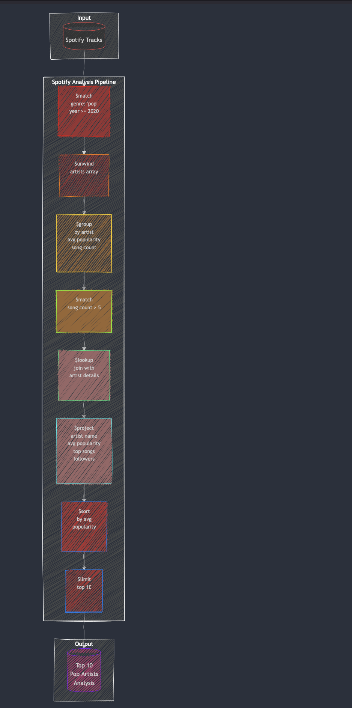

## Aggregation Pipelines

Although we can query and modify the data with direct methods applied to the current collection, MongoDB has a more powerful features that not only filters and projects but also transforms the data.

An **aggregation pipeline** is a framework for processing and transforming data through a sequence of stages, where each stage applies specific operations (e.g., filtering, grouping, projecting) to produce a final result.

An aggregation pipeline consists of one or more stages that process documents:

- Each stage performs an operation on the input documents. For example, a stage can filter documents, group documents, and calculate values.
- The documents that are output from a stage are passed to the next stage.
- An aggregation pipeline can return results for groups of documents. (total, average, maximum, etc ...).


A pipeline is executed with the  `.aggregate` method and a list of JSON objects.

Best to look at an example

```python
cursor = db.movies.aggregate([
    {
        "$match": { "imdb.rating": { "$gt": 8.0 } }
    },
    {
        "$project": {
            "_id": 0,
            "title": 1,
            "imdb.rating": 1,
            "released": 1
        }
    },
    {
        "$sort": { "released": -1 }
    },
    {
        "$limit": 2
    }
])
```

With direct methods this pipeline would come down to

```python
db.movies.find(
    { "imdb.rating": { "$gt": 8.0 } },
    { "_id": 0, "title": 1, "imdb.rating": 1, "released": 1 }
).sort(
    { "released": -1 }
).limit(
    2
)
```

But there are many things that are possible with a pipeline and not possible with direct methods.

### Spotify pipeline




### Joins and $lookups


Here's an example of joining the movies with their comments using a $lookup stage.


```bash
db.movies.aggregate([
    {
        $lookup: {
            from: "comments",           // The collection to join
            localField: "_id",          // The field in the `movies` collection
            foreignField: "movie_id",   // The field in the `comments` collection
            as: "movie_comments"        // Name of the resulting array
        }
    },
    {
        $match: {                      // Filter the movies to include only those with a high IMDb rating
            "imdb.rating": { $gte: 8 }
        }
    },
    {
        $project: {                    // Project only the fields of interest
            _id: 0,
            title: 1,
            "imdb.rating": 1,
            movie_comments: 1
        }
    }
])

```

If we want to

- only return movies with some comments
- and only return a maximum of 2 comments per movies

```javascript
db.movies.aggregate([
    {
        $lookup: {
            from: "comments",           // The collection to join
            localField: "_id",          // The field in the movies collection
            foreignField: "movie_id",   // The field in the comments collection
            as: "movie_comments"        // The resulting array field
        }
    },
    {
        $addFields: {
            movie_comments: { $slice: ["$movie_comments", 2] }  // Limit comments to 2
        }
    },
    {
        $match: {                      // Only include movies with at least 1 comment
            movie_comments: { $ne: [] }
        }
    },
    {
        $project: {                    // Project only the fields of interest
            _id: 0,
            title: 1,
            movie_comments: 1
        }
    }
])
```


- $lookup:
  - Joins the movies collection with the comments collection based on _id in movies and movie_id in comments.
  - Adds an array field movie_comments containing all comments for each movie.

- $addFields:
  - Uses $slice to limit the movie_comments array to a maximum of 2 comments.

- $match:
  - Filters out movies with no comments by ensuring movie_comments is not an empty array ($ne: []).

- $project:
  - Specifies the fields to include in the final result, such as title and movie_comments.

### Unwinding an array

For instance, let's calculate the average imdb rating per genre

```javascript
db.movies.aggregate([
    {
        $unwind: "$genres"
    },
    {
        $group: {
            _id: "$genres",                 // Group by genre
            average_rating: { $avg: "$imdb.rating" },  // Calculate average IMDb rating
            movie_count: { $sum: 1 }        // Count the number of movies in each genre
        }
    },
    {
        $sort: { average_rating: -1 }      // Sort genres by average rating (descending)
    }
])
```

- $unwind:
  - Breaks the genres array into multiple documents, each with a single genre.
  - If a movie has ["Action", "Drama"] in genres, it will become two documents:

    { "title": "Movie A", "genres": "Action" }

    { "title": "Movie A", "genres": "Drama" }

- $match:
  - Filters the documents to include only those where genres is "Action".

- $project:
  - Includes only the fields of interest (title, genres, and imdb.rating) in the output.

- $sort:
  - Orders the results by IMDb rating in descending order.

Use `$unwind` when you need to deconstruct array fields for downstream operations like grouping, sorting, or filtering...

### Links

see
- https://www.mongodb.com/docs/manual/core/aggregation-pipeline/
- https://www.mongodb.com/resources/products/capabilities/aggregation-pipeline
- https://learn.mongodb.com/courses/mongodb-aggregation-in-python
- https://learn.mongodb.com/learn/course/mongodb-crud-operations-in-python/lesson-3-querying-a-mongodb-collection-in-python-applications/learn?client=customer&page=2

- for CRUD in python
  - https://www.mongodb.com/docs/languages/python/pymongo-driver/current/aggregation/aggregation-tutorials/
  - https://learn.mongodb.com/courses/mongodb-crud-operations-in-python

- operators https://www.mongodb.com/docs/manual/reference/operator/query/gt/
- cursors https://www.mongodb.com/docs/manual/reference/method/js-cursor/

- methods for pymongo: https://pymongo.readthedocs.io/en/stable/api/pymongo/cursor.html


### aggregation pipelines go beyond simple queries

While there is some overlap, aggregation pipelines offer more powerful and flexible data transformation and computation capabilities than the simpler query methods.

`find()` queries are limited to filtering documents and optionally projecting fields (including or excluding).

Aggregation pipelines are used for multiple tasks:

- **Data Transformation** :  reshape documents, perform calculations, and add new fields using stages like `$project`, `$group`, and `$addFields`.

  ```json
  [
    { "$group": { "_id": "$genre", "averageRuntime": { "$avg": "$runtime" } } }
  ]
  ```

- **Field Manipulation**: `$unset` in aggregation allows removing fields from documents instead of doing it with projections.

- **Joining collections**:
  ```json
  [
    { "$lookup": { "from": "authors", "localField": "authorId", "foreignField": "_id", "as": "authorDetails" } }
  ]
  ```

- **Document Flow** :  Aggregation pipelines process documents through multiple stages, applying transformations at each stage.

- **Performance**: Aggregation pipelines can leverage stages like `$merge` or `$out` to save results into a new collection, useful for data processing pipelines.

### Group and Total

This follows this [aggregation pipeline tutorial](https://www.mongodb.com/docs/languages/python/pymongo-driver/current/aggregation/aggregation-tutorials/group-total/)


Let's calculate average IMDb rating and Count total movies for each year.

We define the aggregation pipeline


```python
pipeline = [
    {
        "$group": {
            "_id": "$year",  # Group by the "year" field
            "average_imdb_rating": {"$avg": "$imdb.rating"},  # Calculate average IMDb rating
            "total_movies": {"$sum": 1}  # Count total movies for each year
        }
    },
    {
        "$sort": {"_id": 1}  # Sort by year in ascending order
    }
]
```

Then execute it the aggregation pipeline

```python
cursor = db.movies.aggregate(pipeline)
for doc in cursor:
    print(doc)
```

we see that we have weird values for years. Strings values with an extra `é`!

So let's find all the weird years. We can use regex

```python
cursor = db.movies.find({"year": {"$regex": "è"}})
```

but we could also check the data type of the field

```python
pipeline = [
    {"$group": {"_id": {"type": {"$type": "$year"}}, "count": {"$sum": 1}}}
]
```

Which returns

```bash
{'_id': {'type': 'string'}, 'count': 35}
{'_id': {'type': 'int'}, 'count': 21314}
```

Which shows that in MongoDB we can mix data types!

If we want to avoid counting the years that are not ints, we can add a $match clause.
The initial pipeline becomes


```python
pipeline = [
    {
        "$match": {  # Ensure "year" is an integer
            "year": { "$type": "int" }
        }
    },
    {
        "$group": {
            "_id": "$year",  # Group by the "year" field
            "average_imdb_rating": {"$avg": "$imdb.rating"},  # Calculate average IMDb rating
            "total_movies": {"$sum": 1}  # Count total movies for each year
        }
    },
    {
        "$sort": {"_id": 1}  # Sort by year in ascending order
    }
]
```

It looks like old movies are better than recent ones
